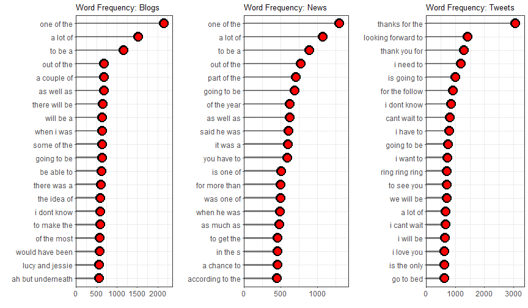

Data Science capstone project
========================================================
author: Oleksandr Fialko
date: 
autosize: true

Objective
========================================================

This slide deck will pitch the capstone project for [the Coursera Data Science specialization](https://www.coursera.org/specializations/jhu-data-science).

The goal was to create a [Shiny app](https://ofialko.shinyapps.io/next_world_predictor) that takes as input a phrase (multiple words) in a text box input and outputs a prediction of the next word.

Text data used to train a model able to  predict the next word comes from [HC Corpora](http://www.corpora.heliohost.org/).

Methodology
========================================================

The HC Corpora data were thoroughly cleaned: punctuations, numbers, URL, profanity words were removed.

After that the data were tokenized into *n*-grams, which is a contiguous sequence of n items from a given sequence of text or speech.

Aggregated in this way 2-,3- and 4-grams were transformed  into frequency distributions and stored in separate data frames.

The application receives a text input and uses the n-grams data frames to predict the next word.

n-grams example
========================================================

These are 3-grams distributions from three different sources:

Model
=========================================================

I have build a *n*-grams model, which does the following:

 - if a user enters one word, the model looks at the frequency distribution of 2-grams starting with that word, finds the most frequent such 2-grams and outputs the second words in them.
 
 - if a user enters two or more words, the model looks for the most frequent 3-grams starting with the previous 2 words entered. If there are no 3-grams, the model looks at 2-grams starting with the previous word entered.
 
The code of the application and the milestone report can be found in [this Git-Hub repo](https://github.com/ofialko/Capstone-Coursera). 

