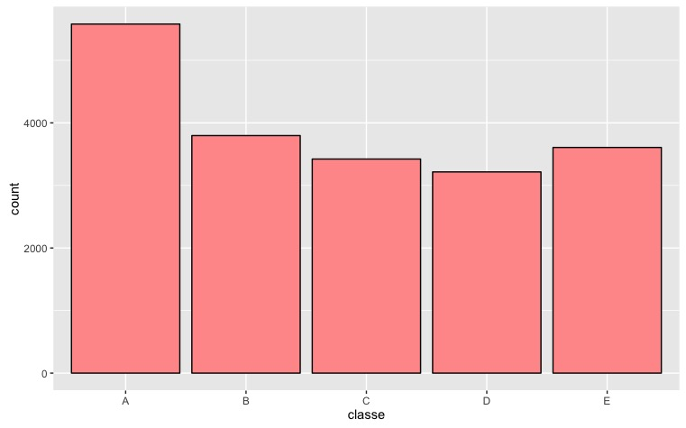

Using electronic devices attached to different parts of their bodies, a group of enthusiasts took measurements about themselves regularly to improve their health. In this project, my task is to use data from accelerometers on the belt, forearm, arm, and dumbell of 6 participants. They were asked to perform lifts in 5 different ways. More information is available from the website here:  <http://groupware.les.inf.puc-rio.br/har>.

### Data

The training data for this project are available here:

<https://d396qusza40orc.cloudfront.net/predmachlearn/pml-training.csv>

The test data are available here:

<https://d396qusza40orc.cloudfront.net/predmachlearn/pml-testing.csv>


```{r eval=FALSE, include=FALSE}
library(caret); library(ggplot2)
library(e1071)
```


### Extracting features

I downloaded the data into R using the following code:

```{r eval=FALSE}
data_train <- read.csv(file = 'pml-training.csv')
data_test <- read.csv(file='pml-testing.csv')
```

This is how activities are distributed in the training set:

```{r eval=FALSE}
ggplot(data_train,aes(x=classe)) + geom_bar(colour='black',fill='#FF9999')
```

{width=80%}


Quick examination of the data files with the `head` command revealed that some columns contain mostly missing values, while others have small variability.

Features with near zero variance can be detected using `nzv` command and then removed from the data set as follows:

```{r eval=FALSE}
nzv <- nearZeroVar(data_train,saveMetrics = F)
data_train1 <- data_train[,-nzv]
```

There are still columns with many `NA`. First, let's calculate the number of `NA` in each columns:

```{r eval=FALSE}
na_count <- sapply(data_train1, function(y) sum(sum(is.na(y))))
unique(na_count)
```
~~~
[1]     0 19216
~~~

It appears that columns split into two groups: having no `NA` and having 19216 `NA` each. The following code removes columns containing any `NA`:

```{r eval=FALSE}
nav <- which(sapply(data_train1, function(x) any(is.na(x))))
features <- names(data_train1)[-nav]
data_train2=data_train[,features]
```

There are still 6 features, which we do not need. They are 
"X", "user_name","raw_timestamp_part_1","raw_timestamp_part_2","cvtd_timestamp", "num_window". We remove them as well:

```{r eval=FALSE}
data_train2 <- data_train2[,-(1:6)]
features <- names(data_train2)
```

We have reduced the number of features from 159 to 52. We are now prepared to apply machine learning techniques to use those remaining features to predict activity.

### Building machine learning model

We start with partitioning the data set into training and testing sets:

```{r eval=FALSE}
inTrain <- createDataPartition(y=data_train2$classe,p=0.7,list = F)
training <- data_train2[inTrain,]
testing <- data_train2[-inTrain,]
```

I preprocess training data using the standard normalization procedure. Moreover, since 52 is still a big number of featurers for my laptop (kidding), I also use PCA to reduce this number while keeping derived features describing 90% of variability:

```{r eval=FALSE}
preObj <- preProcess(training[,-53],method = c('center','scale','pca'),thresh = 0.9)

training_preproc <- predict(preObj,training[,-53])
training_preproc <- data.frame(training_preproc,classe = training$classe)
testing_preproc <- predict(preObj,testing[,-53])
testing_preproc <- data.frame(testing_preproc,classe = testing$classe)
```

This has reduces the number of features from 52 to 18.
Let's calculate and plot the variance of each PCA component:

```{r eval=FALSE}
y <- apply(training_preproc[,-19],2,var)
y<-y/sum(y); x <- 1:18
df<-data.frame(component=x,variance=y)
ggplot(df,aes(x=component,y=variance)) + geom_bar(stat="identity",colour='black',fill='#FF9999')+ylab('normalized variance')
```

{width=80%}

The first 2 components clearly stand out but they are not enough to have strong predictive power as it is seen in the figure below. We better use all 18 derived features for our modeling.

```{r eval=FALSE}
df<-data.frame(PC1 = training_preproc$PC1,PC2=training_preproc$PC2,classe=training_preproc$classe)
qplot(x=PC1,y=PC2,col=classe,data = df)
```

{width=80%}

We use random forests and support vector machine, which are two popular machine learning models in the community:

```{r eval=FALSE}
mod1 <- train(classe~., method='rf',data = training_preproc)
mod2 <- svm(classe~.,data = training_preproc)
```

Random forests gives almost 98% accuracy, while support vector machines gives 91%:
```{r eval=FALSE}
pred1 <- predict(mod1,testing_preproc)
pred2 <- predict(mod2,testing_preproc)
print(paste('RF accuracy: ', sum(pred1==testing_preproc$classe)/length(pred1)))
print(paste('SVM accuracy: ', sum(pred2==testing_preproc$classe)/length(pred2)))
```
~~~
 "RF accuracy:  0.977230246389125"
 "SVM accuracy:  0.909430756159728"
~~~

I also tried to stack these two models to build a better one, however yielding 
the same accuracy as random forests:

```{r eval=FALSE}
predDF <- data.frame(pred1,pred2,classe=testing_preproc$classe)
combModFit <- train(classe~.,method='rf',data=predDF)
combPred <- predict(combModFit,predDF)
sum(combPred==testing_preproc$classe)/length(combPred)
```
~~~
[1]   0.9772302
~~~
with the following confusion matrix:
```{r eval=FALSE}
table(combPred,testing_preproc$classe)
```

~~~
combPred    A    B    C    D    E
       A 1662   31    8    1    2
       B   11 1089    7    3    3
       C    0   17 1000   26    7
       D    1    0    9  931    1
       E    0    2    2    3 1069
~~~

### Predicting activities

I repeated the steps above and apply my model to the test data:

```{r eval=FALSE}
data_test <- data_test[,features[-53]]
data_test_preproc <- predict(preObj,data_test)

pred1V <- predict(mod1,data_test_preproc)
pred2V <- predict(mod2,data_test_preproc)
predVDF <- data.frame(pred1=pred1V,pred2=pred2V)
combPredV <- predict(combModFit,predVDF)
```

After completing the quiz, I got 19 correct predictions out of 20, i.e. 95% accuracy. 
Nice result !

